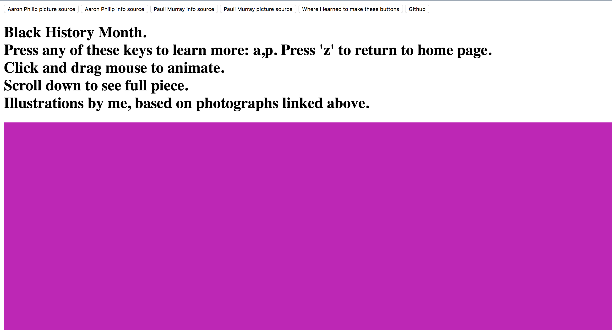
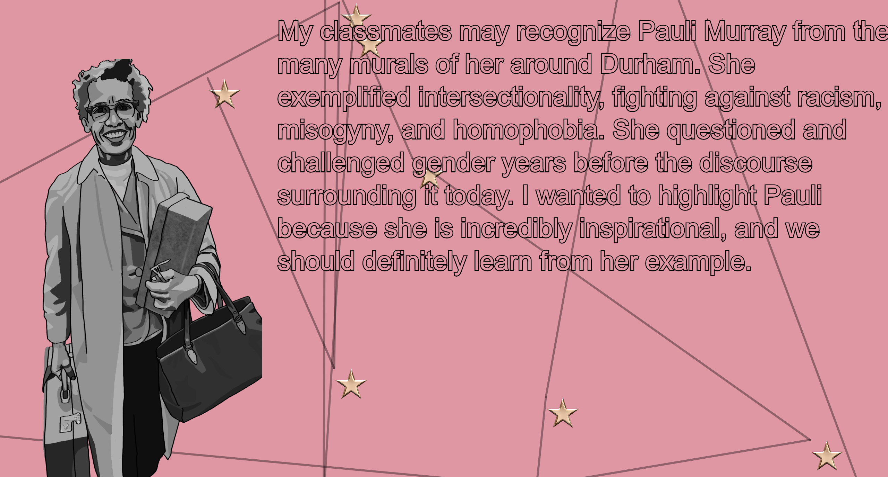

Rethinking my piece:

Who is the audience?
The audience is for anyone who has access to the page. I wanted it to be relatively easily digesitble information, or at the very least, easy to look up on Google and lead to other avenues of learning. 

What does it say to the viewer?
It shares a very brief summary of who Aaron Philip and Pauli Murray are and what they stand for politically. I wanted to focus moreso on their work because it was themed for Black History Month.

What colors did you use and why?
For the "home page" (a.k.a., the colors you first see when you open the piece), the colors are based on the time. I think it is visually interesting to see nonstatic images, so I wanted to work this through my entire piece. I also figured out how to change the colors based on the time in a previous week, and I thought it was fun, so I included that in this piece as well.

As for Aaron Philip's page, I chose colors that matched the red, green, and yellow you often seen attached to symbols and images of the African diaspora. I was inspired to use these colors because of the Black History Month theme.

While I chose those colors for a symbolic reason, they didn't fit together cohesively on the page. So, since Pauli Murray's illustration was in black & white, I chose to use similar shades of grey for the background colors. It looks more cohesive, and the text is more legible, in my opinion.

What images did you use and why?

I used the first images I saw that I think captured each person's essence best. Aaron Philip's image is from her Instagram, so I thought it best to use an image of her from the source. Pauli Murray's image is full body, and I think it's less awkward to see a cutoff picture of someone when the cutoff is at a part of the image that isn't central to the piece (i.e., her dark pants legs are not the focus of the picture). 

I chose to illustrate them because I wanted practice with digital art, and I also wanted to capture my own interpretation of these images because Black History Month is personally meaningful. However, I also traced the images and used the original colors to still partially stay true to the images I was using as references. 

What instances in your life experience have brought you to this work?

I want to bring more diversity to art through character design and other methods of representation, and I wanted to make that statement with my piece. I thought I would introduce what is important to me about art in the project aptly named "Hello World". 

Reworking my piece:
What is at the core of these ideas?

A celebration of black people thriving is at the center of this work. I wanted to showcase people who get pushed to the margins of society's minds, and show them as important, proud, beautiful, happy, and/or anything else they are/want to be. 

What is the essence of what you're trying to create?

I was inspired by infographics I've seen in museums and other places, where the images slightly shift depending on where you're standing or touching the screen, like those holographic rulers. I thought it was cool how they made a few images so dynamic. 

I wanted to create something informative, eye-catching, and celebratory. Simple in its visuals, but not boring.

What feelings or emotions are in the sketch?

I don't know if I succesfully embued any emotions in the sketch. While I was creating it, however, I felt pride and joy, so I will thinking about how I can express those in the sketch instead of just in the code. 

While reworking my sketch, I had the idea to base colors off of their lives. The background colors are based off of their birthdate and the current time, and the colors inbetween, to celebrate their lives and also show that people have an effect on the present, future, and the past, connecting these figures to the present moment because they are here today or have had a lasting effect on today.

I also found an example on the reference website Matt shared. I turned it into a background animation that shows stars when you click and drag the mouse. It is not quite as animated as I would like, but I think this is a good starting point in terms of adding some happiness, wonder, and pride to the piece, since thats what stars can represent, to me.

Bibliography

Curtin, Frank C. Picture of Pauli Murray smiling at camera. WUNC 91.5: North Carolina Public Radio. Rao, Anita; Stasio, Frank. http://www.wunc.org/post/firebrand-and-first-lady 

Iovannone, Jeffry J. "Pauli Murray: "Jane Crow"." Medium, 3 Jun. 2018. https://medium.com/queer-history-for-the-people/pauli-murray-jane-crow-6f38afaadaaf. 

Pay It No Mind. "A photo of Marsha P. Johnson." Wikipedia, the Free Encyclopedia, 7 Oct. 2017, https://en.wikipedia.org/wiki/Marsha_P._Johnson. 

Philip, Aaron. "girl, interrupted." Instagram, 7 Jan. 2019, https://www.instagram.com/aaron___philip/?hl=en. 

Philip, Aaron. "I'm a Black, Trans, Disabled Model - And I Just Got Signed to a Major Agency." them., 4 Sept. 2018, https://www.them.us/story/aaron-philip-signed-to-modeling-agency.

Unknown. A photograph of Barbara Jordan smiling and waving. GLSEN, https://www.glsen.org/blog/womens-history-month-heroes-barbara-jordan. 

Unknown. A photograph of Billy Strayhorn playing a drum. Scottish National Jazz Orchestra, 18 Feb. 2015, https://snjo.co.uk/blog/composer-billy-strayhorn-in-the-limelight-at-last/. 

Unknown. A photograph of Elle Hearns at a desk. Trans Justice Funding Project, 31 Mar. 2016, https://www.transjusticefundingproject.org/introducing-2016-tjfp-panelist-elle-hearns/. 

Vechten, Carl Van. "Bessie Smith (April 15, 1894 – September 26, 1937), an American blues singer." Wikipedia, the Free Encyclopedia, 27 Jan. 2012, https://en.wikipedia.org/wiki/Bessie_Smith. 

Vespa, Jeff. A photograph of Angela Davis smiling. Essence, 22 Oct. 2018, https://www.essence.com/news/angela-davis-to-receive-the-birmingham-civil-rights-institutes-highest-honor/.

Yan, Frank. A photograph of CeCe McDonald speaking at a microphone. The Chicago Maroon, 17 Oct. 2014, https://www.chicagomaroon.com/article/2014/10/17/uncommon-interview-cece-mcdonald/. 